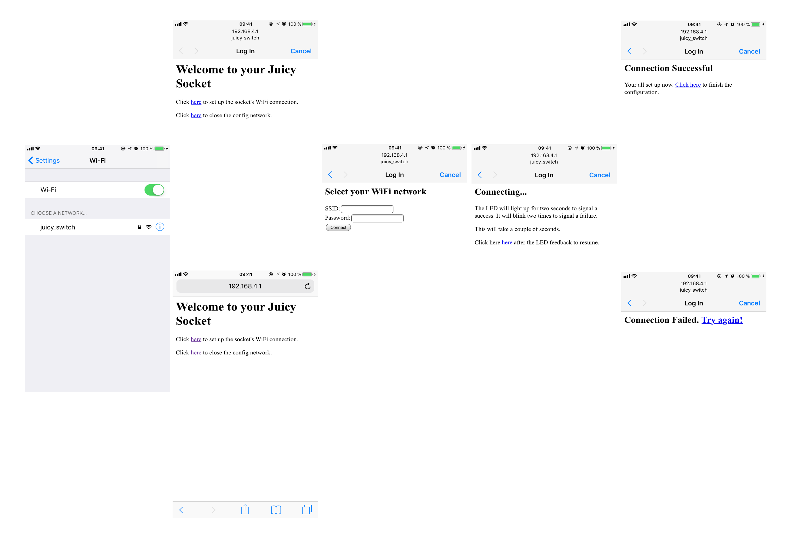

# Juicy Switch Firmware 🔌 🍊 💻

⚠️ **This is work in progress!** ⚠️

The firmware powering Juicy's *esp* chip. It lets you configure the WiFi that Juicy should connect to and provides a RESTful API for controlling the chip's LED. Later, when Juicy is fully assembled, you will be able to power the socket on and off via that API.

## Features

The following is a rough outline of features we want to implement. Already implemented features are marked accordingly.

- [x] Easy configuration of Juicy's WiFi connection
- [x] Configuration via a captive portal (tested on iOS)
- [x] Persisted WiFi credentials
- [x] Auto connect if correct WiFi credentials are available
- [x] LED feedback on successful or failed WiFi configuration
- [x] MDNS hostname for the API endpoint
- [ ] Automatic reconnection if WiFi connection is lost
- [ ] Nice looking configuration interface
- [ ] Unique API hostname
- [ ] WiFi scan for an easier configuration process
- [ ] ...

## Getting Started

### Development & Installation

The easiest way to get the Juicy firmware up and running on your esp chip is using the [*PlatformIO IDE*](http://platformio.org/get-started/ide) or [*PlatformIO Core*](http://platformio.org/get-started/cli).

[Here](http://docs.platformio.org/en/latest/ide/atom.html#quick-start) you can find instructions on how to setup PlatformIO IDE for [Atom](https://atom.io). Just import Juicy's `/firmware` directory as a project and you're ready to go.

### Usage

Assuming you have just flashed the firmware onto your esp chip and not connected it to your WiFi before you can use your phone or another WiFi enabled device to configure the chip:



1. Make sure the chip is powered on.
2. Connect to the Juicy configuration network (`juicy_switch`) using your phone or another device.
3. Once you connected to the Juicy configuration network, a captive portal dialogue displaying the Juicy configuration page may appear.

	- *Note:* If the captive portal dialogue does not appear, you can just use your browser when connected to the Juicy configuration network and point it to `192.168.4.1` to start the configuration process. If you don't like typing IP's, just go to any website when connected to the Juicy configuration network (e.g. `example.com`) and you will be redirected to the configuration page.

4. You should now see the Juicy configuration page.
5. Follow the instructions on the Juicy configuration page.
6. Type in the credentials of your WiFi network.
7. Wait for the LED feedback on your chip.

	- If the chip cannot connect to your WiFi, the LED will blink two times.
	- If the chip successfully connected to your WiFi, the LED will light up continuously for two seconds.

8. Follow the instructions on the Juicy configuration page. If the connection failed, you'll be given a link to retype the credentials of your WiFi. If the connection succeeded, you'll be given a link to finish the configuration process.
9. Once you finished the configuration process, your chip will be connected to your WiFi and the Juicy configuration network will be closed.

Congratulations, Juicy is now setup and ready to go. You can use *[nmap](https://nmap.org)* to find out it's IP or just access it via `juicy_switch.local`. It's recommended to use the IP directly since it seems to be faster.

You can also shut down your chip now. If you power it up again it will remember your WiFi network's credentials and automatically connect to it on startup. If you change your WiFi credentials, just restart the chip. It will notice that the old credentials do not work anymore and reopen the Juicy configuration network for you to provide the new credentials.

**Note:** Your WiFi's credentials will be stored on the esp chip in *plain text* (unencrypted). 

### API

#### Configure and Setup

``` c++
// Create an API instance with a certain hostname.
API api("juicy_hostname");
	
// Add a PIN that will be toggled by the API.
// The first parameter is the pin.
// The second parameter is the ON value.
// The second parameter is the OFF value.
api.addPin(LED_BUILTIN, LOW, HIGH);
	
// After adding all desired pins, stup the API.
api.setup();
	
/* Later on in your main loop() */
	
// Serve the API.
api.serve();
```

#### Endpoints

The API serves the following endpoints:

``` shell
# Writes the previously specified ON value to all added pins.
curl juicy_switch.local/on

# Writes the previously specified OFF value to all added pins.
curl juicy_switch.local/off

# Returns a JSON containing a `status` value that is either:
# - `on` if all pins are on
# - `off` if all pins are off
# - `undefined` if no common pin status could be determined.
curl juicy_switch.local/status
```


 