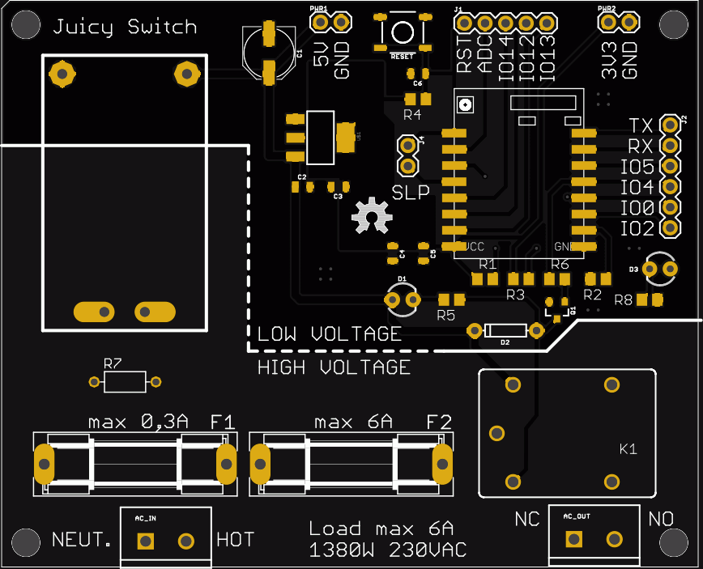
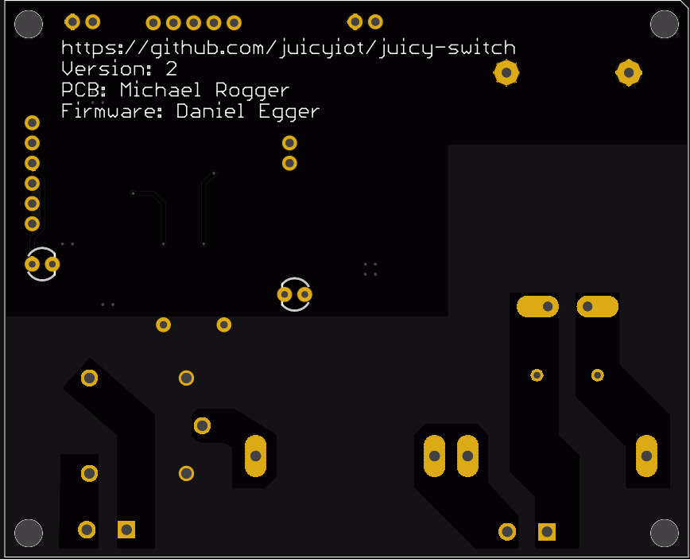

# Juicy Switch Hardware :electric_plug::tangerine:

## :warning: Disclaimer :zap:
Mains can kill or severly injure people! Please read about electrical saftey first.
We designed the PCB to the best of our knowledge to be safe (see [Safety](#safety) and [Enclosure](#enclosure)), however **use it at your own risk**, we are no electrical engineers!

## Hardware

### Bill of Materials

The cost per unit is roughly 10$.

| Marking    | Item             | Package           | Value         |
------------ | ---------------- |------------------ | ------------- |
|            | µC-ESP826 ESP-07 | -                 | -             |
|            | HLK-PM01         | -                 | -             |
| R1,R2,R6,R8| resistor         | SMD 0815          | 10kΩ          |
| R3,R4      | resistor         | SMD 0815          | 1kΩ           |
| R5         | resistor         | SMD 0815          | 120Ω          |
| R7         | varistor         | THT               | 250VAC/2500A  |
| C1         | capacitor        | SMD 0815          | 22µF          |
| C2,C4      | capacitor        | SMD 0815          | 10µF          |
| C3         | capacitor        | SMD               | 100µF         |
| C5,C6      | capactior        | SMD 0815          | 100nF         |
| J3,J5      | screw terminal   | THT               | 5m            |
| D1,D3      | LED              | THT               | 3mm           |
| D2         | diode 1n4148     | THT               | 200mA/100V/1V |
| F1         | fuse (slow blow) | glass tube 5x20mm | 0.3A          |
| F2         | fuse (fast blow) | glass tube 5x20mm | 6.3A          |
| F1,F2      | fuse holder      | THT 5x20mm        | -             |
| Q1         | transistor npn   | SMD SOT23-3       | 0.5A/40V      |
| K1         | relay            | -                 | 10A/250VAC    |
| U1         | voltage regulator| SOT23-3           | 3.3V          |
| S1         | tactile switch   | SMD (4x4x1.5mm)   | -             |
| J1,J2,J4,J6 | Headers         | THT               | -             |

#### Schematic

#### Board
Seeedstudio manufactured our board (2 layer and 1oz of copper).

### Assembly
- Solder the ESP and related resistors/capcitors.
- Flash the ESP with a bootloader, upload our sketch and verify it is correctly running.
- Solder the power supply and the related fuse/varistor.
- Solder the relay and related fuse.

### Enclosure
The PCB **must** be enclosed by a **plastic** box. Use **non conducting** materials, e.g. plastic standoffs. The box should be kept in a dry environment (inside). Do not open the box while connected to mains, always unplug first.

### Sources
- https://esp8266.github.io/Arduino/versions/2.3.0/doc/boards.html
- http://www.learnabout-electronics.org/PSU/psu10.php
- http://circuitcalculator.com/wordpress/2006/01/31/pcb-trace-width-calculator/
- http://lygte-info.dk/review/Power%20Mains%20to%205V%200.6A%20Hi-Link%20HLK-PM01%20UK.html
- https://forum.mysensors.org/topic/1607/safe-in-wall-ac-to-dc-transformers
- http://www.reo.co.uk/files/safety_7_-_low_voltage_directive.pdf
- http://creepage.com/